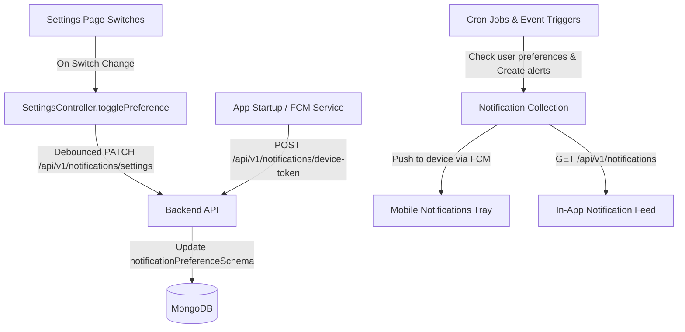

# Notification Settings & In-App Notification System — Architecture & API Documentation

## 1. Executive Summary & Overview
This document specifies the end-to-end design and API contracts for:
1. **Notification Preferences / Settings** (Managing user notification toggles configured in the mobile app settings).
2. **In-App Notifications List & Feed** (Fetching notifications, unread badges, mark as read, and bulk operations).
3. **Push Notification Device Token Registration** (FCM / APNs token management for mobile devices).

---

## 2. Frontend Settings Notification Review (Current Analysis)

In [settings_page.dart](file:///c:/ProjectsOffice/ABBBE%20HOSSAIN/abbe_hossain_frontend/lib/features/profile/settings/page/settings_page.dart#L156-L239) and [settings_controller.dart](file:///c:/ProjectsOffice/ABBBE%20HOSSAIN/abbe_hossain_frontend/lib/features/profile/settings/controller/settings_controller.dart#L27-L34), there are **7 distinct notification preference switches**:

| Frontend Switch Variable | UI Title | Description & Triggers | Default Value |
| :--- | :--- | :--- | :--- |
| `renewalReminders` | **Renewal reminders** | Notifies the user 2–3 days prior to an upcoming subscription billing date. | `true` |
| `priceIncreases` | **Price increases** | Alerts the user when a subscription cost changes or a popular service price updates. | `true` |
| `unusedSubscriptions` | **Unused subscriptions** | Proactive AI coach alert for subscriptions that haven't been tracked or used recently. | `true` |
| `budgetAlerts` | **Budget alerts** | Triggered when variable expenses cross 80% or 100% of the calculated monthly budget. | `false` |
| `savingsReminders` | **Savings reminders** | Reminds users of monthly savings goal progress and deposit deadlines. | `false` |
| `weeklyReport` | **Weekly report** | Summary digest delivered every Sunday with weekly expense insights. | `false` |
| `monthlyReport` | **Monthly report** | Comprehensive monthly financial health & budget breakdown on the 1st of each month. | `false` |

---

## 3. Database Schema Design (MongoDB / Mongoose)

### 3.1. `NotificationPreference` Model (`notificationPreferenceSchema`)
Stores the configuration switches per user:

```typescript
import { Schema, model, Types } from 'mongoose';

export interface INotificationPreference {
  user: Types.ObjectId;
  renewalReminders: boolean;
  priceIncreases: boolean;
  unusedSubscriptions: boolean;
  budgetAlerts: boolean;
  savingsReminders: boolean;
  weeklyReport: boolean;
  monthlyReport: boolean;
  pushEnabled: boolean;
  emailEnabled: boolean;
}

const notificationPreferenceSchema = new Schema<INotificationPreference>(
  {
    user: {
      type: Schema.Types.ObjectId,
      ref: 'User',
      required: true,
      unique: true,
    },
    renewalReminders: { type: Boolean, default: true },
    priceIncreases: { type: Boolean, default: true },
    unusedSubscriptions: { type: Boolean, default: true },
    budgetAlerts: { type: Boolean, default: false },
    savingsReminders: { type: Boolean, default: false },
    weeklyReport: { type: Boolean, default: false },
    monthlyReport: { type: Boolean, default: false },
    pushEnabled: { type: Boolean, default: true },
    emailEnabled: { type: Boolean, default: false },
  },
  { timestamps: true }
);

export const NotificationPreference = model<INotificationPreference>(
  'NotificationPreference',
  notificationPreferenceSchema
);
```

### 3.2. `Notification` Item Model (`notificationSchema`)
Stores individual in-app notification alerts:

```typescript
export interface INotification {
  user: Types.ObjectId;
  title: string;
  message: string;
  type: 'renewal' | 'price_increase' | 'unused_sub' | 'budget_alert' | 'savings_goal' | 'report' | 'system';
  isRead: boolean;
  data?: Record<string, unknown>; // e.g. { subscriptionId, amount, targetScreen }
  createdAt: Date;
  updatedAt: Date;
}

const notificationSchema = new Schema<INotification>(
  {
    user: { type: Schema.Types.ObjectId, ref: 'User', required: true, index: true },
    title: { type: String, required: true },
    message: { type: String, required: true },
    type: {
      type: String,
      enum: ['renewal', 'price_increase', 'unused_sub', 'budget_alert', 'savings_goal', 'report', 'system'],
      default: 'system',
    },
    isRead: { type: Boolean, default: false, index: true },
    data: { type: Schema.Types.Mixed, default: {} },
  },
  { timestamps: true }
);

export const Notification = model<INotification>('Notification', notificationSchema);
```

### 3.3. `DeviceToken` Model (For FCM / Push Notifications)

```typescript
export interface IDeviceToken {
  user: Types.ObjectId;
  fcmToken: string;
  deviceType: 'android' | 'ios' | 'web';
  isActive: boolean;
}

const deviceTokenSchema = new Schema<IDeviceToken>(
  {
    user: { type: Schema.Types.ObjectId, ref: 'User', required: true },
    fcmToken: { type: String, required: true, unique: true },
    deviceType: { type: String, enum: ['android', 'ios', 'web'], required: true },
    isActive: { type: Boolean, default: true },
  },
  { timestamps: true }
);

export const DeviceToken = model<IDeviceToken>('DeviceToken', deviceTokenSchema);
```

---

## 4. API Endpoints Specification

### 4.1. Get User Notification Settings
- **Route:** `/api/v1/notifications/settings`
- **Method:** `GET`
- **Auth:** Bearer Token (Private)
- **Response `200 OK`:**
```json
{
  "statusCode": 200,
  "success": true,
  "message": "Notification preferences retrieved successfully",
  "data": {
    "renewalReminders": true,
    "priceIncreases": true,
    "unusedSubscriptions": true,
    "budgetAlerts": false,
    "savingsReminders": false,
    "weeklyReport": false,
    "monthlyReport": false,
    "pushEnabled": true,
    "emailEnabled": false
  }
}
```

---

### 4.2. Update Notification Settings
- **Route:** `/api/v1/notifications/settings`
- **Method:** `PATCH` / `PUT`
- **Auth:** Bearer Token (Private)
- **Request Body:**
```json
{
  "renewalReminders": true,
  "priceIncreases": false,
  "unusedSubscriptions": true,
  "budgetAlerts": true,
  "savingsReminders": false,
  "weeklyReport": true,
  "monthlyReport": true
}
```
- **Response `200 OK`:**
```json
{
  "statusCode": 200,
  "success": true,
  "message": "Notification preferences updated successfully",
  "data": {
    "renewalReminders": true,
    "priceIncreases": false,
    "unusedSubscriptions": true,
    "budgetAlerts": true,
    "savingsReminders": false,
    "weeklyReport": true,
    "monthlyReport": true,
    "pushEnabled": true,
    "emailEnabled": false
  }
}
```

---

### 4.3. Register Device FCM Token (Push Notifications)
- **Route:** `/api/v1/notifications/device-token`
- **Method:** `POST`
- **Auth:** Bearer Token (Private)
- **Request Body:**
```json
{
  "fcmToken": "f78d9s7f_example_fcm_token_here_xyz123",
  "deviceType": "android"
}
```
- **Response `200 OK`:**
```json
{
  "statusCode": 200,
  "success": true,
  "message": "Device registered for push notifications successfully"
}
```

---

### 4.4. Fetch In-App Notification Feed
- **Route:** `/api/v1/notifications`
- **Method:** `GET`
- **Auth:** Bearer Token (Private)
- **Query Parameters:** `page=1&limit=20&isRead=false`
- **Response `200 OK`:**
```json
{
  "statusCode": 200,
  "success": true,
  "message": "Notifications retrieved successfully",
  "meta": {
    "page": 1,
    "limit": 20,
    "total": 3,
    "unreadCount": 2
  },
  "data": [
    {
      "_id": "664b1f8f9c0e2a3b4c5d6e7f",
      "title": "Upcoming Subscription Renewal",
      "message": "Netflix (149 USD) will renew in 2 days.",
      "type": "renewal",
      "isRead": false,
      "data": {
        "subscriptionId": "664b1f8f9c0e2a3b4c5d6e88",
        "targetScreen": "subscription_detail"
      },
      "createdAt": "2026-09-27T08:30:00.000Z"
    },
    {
      "_id": "664b1f8f9c0e2a3b4c5d6e80",
      "title": "Budget Alert",
      "message": "You have spent 85% of your monthly variable budget.",
      "type": "budget_alert",
      "isRead": false,
      "data": {
        "targetScreen": "budget"
      },
      "createdAt": "2026-09-26T14:15:00.000Z"
    }
  ]
}
```

---

### 4.5. Mark Notification as Read
- **Route:** `/api/v1/notifications/:id/read`
- **Method:** `PATCH`
- **Auth:** Bearer Token (Private)
- **Response `200 OK`:**
```json
{
  "statusCode": 200,
  "success": true,
  "message": "Notification marked as read"
}
```

---

### 4.6. Mark All Notifications as Read
- **Route:** `/api/v1/notifications/mark-all-read`
- **Method:** `PATCH`
- **Auth:** Bearer Token (Private)
- **Response `200 OK`:**
```json
{
  "statusCode": 200,
  "success": true,
  "message": "All notifications marked as read",
  "data": {
    "modifiedCount": 2
  }
}
```

---

### 4.7. Delete Notification
- **Route:** `/api/v1/notifications/:id`
- **Method:** `DELETE`
- **Auth:** Bearer Token (Private)
- **Response `200 OK`:**
```json
{
  "statusCode": 200,
  "success": true,
  "message": "Notification deleted successfully"
}
```

---

## 5. Frontend Integration Architecture



### Frontend Implementation Checklist:
1. **SettingsController:**
   - In `onInit()`, call `GET /api/v1/notifications/settings` to fetch and bind remote switch states.
   - When a switch is toggled, send a debounced `PATCH` request to save preferences.
2. **Home Screen Notification Bell Icon:**
   - On tap of the bell icon on the Home page, navigate to a `NotificationListPage`.
   - Display an unread badge indicator if `unreadCount > 0`.
